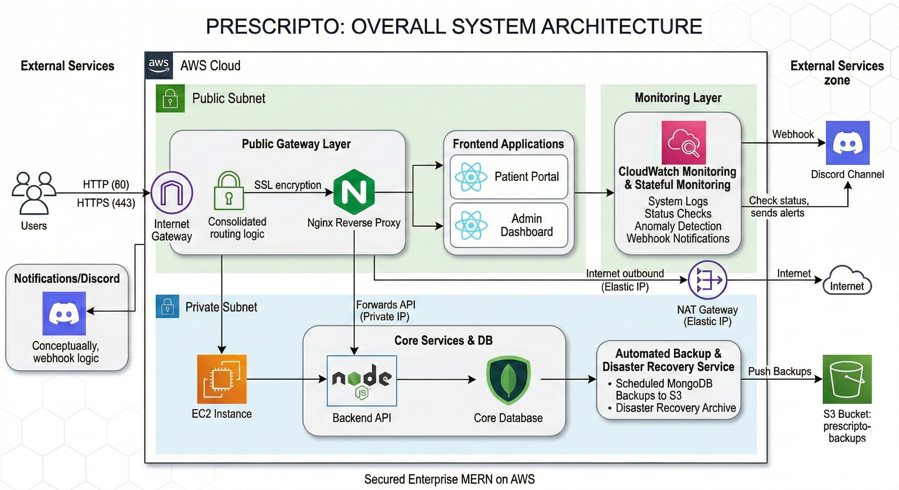

# 🏥 Prescripto: Enterprise MERN Architecture on AWS

## 🚀 Project Overview
**Prescripto** is a comprehensive Doctor Appointment booking system. However, this repository focuses on transforming a standard MERN stack application into a **Highly Available, Secure, and Production-Ready Enterprise Architecture** deployed on Amazon Web Services (AWS).

Instead of relying on basic local deployments, this project implements standard DevOps and Cloud Architect principles, including Custom VPCs, Zero-Trust Security, automated Disaster Recovery, and FinOps log management.

## 🏗️ Cloud & DevOps Features

* **🐳 Containerization:** Completely decoupled from the host OS using Docker. Independent images for Frontend, Admin, and Backend managed via Docker Compose.
* **🔐 Custom AWS VPC (Virtual Private Cloud):**
  * **Public Subnet:** Hosts the Nginx Reverse Proxy and Frontend applications, accessible via the Internet Gateway.
  * **Private Subnet:** Acts as a secure vault for the Node.js API and MongoDB. It has no direct internet access, utilizing a NAT Gateway for outbound updates only.
* **🛡️ Zero-Trust Security & IAM:**
  * Strict Security Groups ensuring the Database and Backend only accept traffic originating from the Nginx Public Server.
  * Passwordless authentication for AWS services using IAM Roles (`AmazonS3FullAccess`, `CloudWatchAgentServerPolicy`).
* **🚦 Reverse Proxy & SSL (Nginx):** Nginx acts as the primary traffic controller, routing API calls securely to the private subnet and enforcing HTTPS via OpenSSL self-signed certificates.
* **🗄️ Automated Disaster Recovery (S3):** A custom Bash script and Cronjob run daily at 3:00 AM to execute `mongodump`, compress the database state, and securely push the archive to a completely private AWS S3 bucket.
* **🚨 Stateful Monitoring (Discord Pager):** A custom watchdog script continuously monitors the application's HTTP status. It utilizes "Lock File" logic to prevent alert fatigue, sending automated Webhook notifications to a Discord channel only when the server goes down, and a resolution message when it recovers.
* **Log Retention:** Integrated AWS CloudWatch Agent to stream Nginx access and error logs directly to the AWS Console, implementing a strict 7-Day retention policy to optimize cloud costs.

## 🛠️ Technology Stack
* **Cloud Infrastructure:** AWS (EC2, VPC, S3, CloudWatch, IAM, NAT/IGW)
* **DevOps Tools:** Docker, Docker Compose, Nginx, Bash Scripting, Linux Cronjobs
* **Frontend:** React.js, Vite, Tailwind CSS
* **Backend:** Node.js, Express.js
* **Database:** MongoDB

## 👨‍💻 Author
**Wajahat Rasool**
